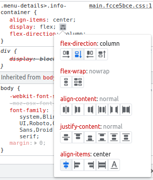

# Waffle Studio React Seminar 2.5
by 안중원

---
## Contents

- CSS로 레이아웃 짜기
    - `position`
    - Flow
        - Normal Flow
        - Flexbox
        - Grid
- JS 함수형 프로그래밍
    - 순수함수, 부작용, 불변성
    - Array 사용법
---
# CSS로 레이아웃 짜기

---
## `position`

`position`은 이 요소의 위치를 계산하는 기준점을 지정한다.

구체적인 위치는 지정된 원점을 기준으로 `top`, `right`, `bottom`, `left` 값에 따라 결정된다.

---
## `position: static, relative`

`static`과 `relative`는 자신만의 공간을 차지한다.

* `static`: default 값. 여러분이 생각하는 그 자연스러운 위치에 놓입니다.
* `relative`: 자연스러운 위치를 기준으로 offset을 지정할 수 있다. 다른 요소들은 *마치 이 요소가 제자리에 있는 것처럼* 배치된다.

---
## `position: absolute, fixed`
`absolute`과 `fixed`는 부모 요소를 기준으로 위치를 지정한다.
다른 요소들은 *마치 이 요소가 없는 것처럼* 배치된다.
* `absolute`: `position`이 지정된 가장 가까운 부모 요소가 기준.
* `fixed`: 전체 화면이 기준.

---
# Flow

---
## Flow
* 이론상 요소들의 (거의) 모든 위치는 width height top right bottom left로 지정할 수 있다.
* 실제로 많은 수강생 분들이 과제1에서 `position: absolute` 먹이고 `%`와 `px`만으로 레이아웃을 만들었습니다.
* 그런 노가다를 W3C에서 그대로 놔뒀을리 없음 &rarr; 여러가지 Flow로 유연한 레이아웃을 만들자!

---
## Normal Flow
특별히 지정하지 않았을 때의 기본 flow.
모든 요소는 **block** 또는 **inline**이며, 좌에서 우로 위에서 아래로 자연스럽게 요소가 배치된다.

| 특징 | block | inline |
|------|-------|--------|
| 크기 | 좌우로 최대한 늘어남 | 딱 내용을 감쌀 수 있는 크기. 자유롭게 조절이 안 됨 |
| 위치 | 새로운 줄에 배치됨 | 이전 내용의 바로 오른쪽에 배치됨. 넘치면 다음 줄로 넘어감 |

---
## Flexbox
요소를 **1차원**으로 배치한다.
* default는 모든 자식이 내용에 딱 맞는 크기로 가로로 배치되는 레이아웃.
```css
.flex {
    display: flex;
}
```


---
## Flexbox - 부모 설정
```css
.flex {
    display: flex;
    flex-direction: row; /* main 축의 가로세로. */
    flex-wrap: wrap; /* 넘치는 요소를 줄바꿈. */
    /* flex-flow: row wrap; */
}
```

---
## Flexbox - 자식 설정
* `flex`: 지정한 숫자로 이 요소가 Flexbox에서 차지하는 비중이 정해짐
* e. g. 자식들의 `flex` 값이 1, 2, 1, 3이면, 너비가 1:2:1:3이 된다.
    * 예를 들어 두 번째 요소는 전체 너비의 2/7을 차지한다.

---
## Flexbox - 정렬
부모 요소에 CSS로 지정해서 자식 요소를 정렬
```css
.flex {
    align-items: center; /* cross 축 정렬 */
    justify-content: flex-end; /* main 축 정렬 */
}
```

---
## Flexbox - 실제 사용 예
* [과제1 예시](https://d6mc9ze3pkchi.cloudfront.net/)
* 개발자도구 :+1:
 

* flex 안에 flex를 넣으면 2차원 배치도 웬만큼 됩니다.
* 한 줄 안에서 가로로 배치하고 여러 줄을 다시 세로로 늘어놓는 식

---
## Grid
요소를 **2차원**으로 배치한다.
```css
.grid {
    display: grid;
}
```

---
## Grid - 부모 설정
우선 가로 세로로 요소를 몇 개씩 배치할지 정한다.
```css
.grid {
    display: grid;
    grid-template-columns: 200px 1fr 2fr;
    gap: 10px;
    grid-auto-rows: 100px;
}
```

---
## Grid - 자식 설정
각 자식의 위치를 grid 내의 좌표로 설정할 수 있다.
```css
.gc {
    grid-column: 1 / 3;
    grid-row: 2 / 4;
}
```


---
## Grid - `grid-template-areas`
grid의 영역에 이름을 붙이고 배치할 수 있다?!
```css
.grid {
    display: grid;
    grid-template-areas:
        "header header"
        "sidebar content"
        "footer footer";
    grid-template-columns: 100px 1fr;
    gap: 20px;
}

header { grid-area: header; }
article { grid-area: content; }
aside { grid-area: sidebar; }
footer { grid-area: footer; }
```

---
## Grid - 실제 사용 예
* [과제1 예시](https://d6mc9ze3pkchi.cloudfront.net/)


---
# JS 함수형 프로그래밍
별건 아니고 하나하나 코멘트 다는 게 너무 귀찮았어서 각 잡고 설명하는 겁니다.

---
## 함수형 프로그래밍

* 명령형 프로그래밍에서 프로그램이란 여러 명령어를 순차적으로 실행하는 것.
    * 메모리에 저장된 상태값을 바꾸면서 흐름을 제어한다.
* 함수형 프로그래밍에서 프로그램이란 주어진 값을 함수에 넣어 결과를 얻는 것.
    * 상태라는 개념이 사라지고, 입력값과 출력값의 관계가 중요해진다.

문제 해결의 접근 방식이 달라진다!

---
## 순수함수와 부작용

* 부작용: side effect. 출력, 오류, 외부 상태 변경 등 함수 바깥에 발생하는 효과.
* 순수함수: pure function. 부작용이 없는 함수.
* `f(x)`가 순수함수라면 다음 두 프로그램은 **똑같은** 동작을 한다.
```javascript
y = f(3) * f(3)
```
```javascript
z = f(3)
y = z * z
```

---
## 순수함수와 부작용
* `f(x)`가 부작용이 있다면, 예를 들어 "hello"를 출력한다면 두 프로그램의 동작은 달라진다.
```javascript
y = f(3) * f(3)
// hello hello
```
```javascript
z = f(3)
y = z * z
// hello
```

---
## 불변성
명령형 프로그래밍에서는 프로그램을 실행하기 위해 필요한 *상태*를 정의하고, 프로그램이 실행되면서 그 상태를 어떻게 변화시킬지 추적해야 한다.
```javascript
function imperative(n) {
    let sum = 0;
    // sum: 0
    for (let i = 0; i <= n; ++i) {
        // sum: (i-1)까지 더한 값, i: 다음에 더할 값
        sum += i;
        // sum: i까지 더한 값, i: 방금 더한 값
    }
    // sum: n까지 더한 값
}
```

---
## 불변성
함수형 프로그래밍에서는 프로그램의 입력에 대한 출력을 정의한다. 함수형 프로그래밍에서 사용하는 "변수"는 개념적으로는 어떤 값에 대한 *별명*일 뿐이다.
```javascript
function functional(n) {
    if (n <= 0) {
        return 0;
    } else {
        // sum_before_n: i-1까지 더한 값의 *별명*
        const sum_before_n = functional(n - 1);
        return n + sum_before_n;
    }
}
```

---
## 왜 함수형 프로그래밍을 해야 하는가?
* React가 함수형 프로그래밍을 가정한다.
    * 최신 React는 함수 컴포넌트가 순수함수라고 가정하여, 함수의 실행을 중간에 멈추거나 이전 결과를 재활용하기도 한다.
    * `useState`, dependency array 등 불변성을 가정하고 만든 기능들이 많다.
* 코드가 읽기 편해진다.
    * 코드도 에쎄이처럼 독자를 고려해서 써야한다.
    * 심지어 다른 사람이 이어서 쓸 수 있어야 하기 때문에 더욱더 중요
    * 돌아가는 코드 > 가독성 >>> 성능

---
## 함수형 프로그래밍을 어떻게 하는가?
* 사실 리액트 앱의 모든 코드를 함수형으로 짜는 건 불가능.
* 최대한 많은 부분을 함수형으로 추상화하고, 명령형으로 짜는 로직은 가능한 단순하게
* 변수(`let`) 사용 및 객체 수정 지양
* Array 관련해서 쓸 수 있는 불변성 함수가 많다.

---
## 불변성 규칙
JS는 `const` 개념이 허술해서 오브젝트나 배열의 수정은 안 막는다.
프로그래머가 알아서 피해야 한다.
모든 변수에 불변성을 지키고, 변수의 값을 바꾸는 걸 예외로 하자.
~~C++이었다면 컴파일러가 알려줬을텐데...~~
```javascript
// Do not:
a.prop = 1;
a[0] = 4;
a.push(3);

// Do
newA = { ...a, prop: 1};
newA = a.map((e, i) => i === 0 ? 4 : e);
newA = [...a, 3];
```

---
## 불변성 규칙 - 까다로운 사례
```javascript
const rawContent = "...";
let jsonContent;
try {
    jsonContent = JSON.parse(rawContent);
} catch(e) {
    if (e instanceof SyntaxError)
        jsonContent = null;
    else
        throw e; // do not catch other error
}
// ...
return <ContentView content={jsonContent ?? rawContent} />;
```

---
## 불변성 규칙 - 까다로운 사례
해당 부분을 새로운 함수로 만들면 해결!
```javascript
function parseOrNull(rawContent) {
    try {
        return JSON.parse(rawContent);
    } catch(e) {
        if (e instaceof SyntaxError)
            return null;
        else
            throw e;
    }
}

const rawContent = "...";
const jsonContent = parseOrNull(rawContent);
// ...
return <ContentView content={jsonContent ?? rawContent} />;
```

---
## `Array.map`
$a.\mathrm{map}(f) = [f(a_0), f(a_1), \cdots, f(a_{n-1})]$
<!-- _{} 이상한 기울임꼴 제거 -->
```javascript
const square = (x) => x * x;
const array = [1,2,3,4,5];
console.log(array.map(square)); // [1,4,9,16,25]
```

---
## `Array.map`을 활용한 update
```javascript
const menus = [ ... ];
const newMenu = { ... };

// 각 메뉴에 대해, id가 3이면 새 메뉴, 아니면 기존 메뉴를 넣는다.
setMenus(menus.map((oldMenu) => oldMenu.id === 3 ? newMenu : oldMenu));
```

---
## `Array.filter`

$a.\mathrm{filter}(p) = [a_i | p(a_i)]$

```javascript
const isPrime = (x) => /* if x is prime then true else false */;
const array = [1,2,3,4,5,6,7,8,9,10];
console.log(array.filter(isPrime)); // [2,3,5,7]
```

---
## `Array.every` & `Array.some`
$a.\mathrm{every}(p) = p(a_0) \text{ and } p(a_1) \text{ and } \cdots \text{ and } p(a_{n-1})$
$a.\mathrm{some}(p) = p(a_0) \text{ or } p(a_1) \text{ or } \cdots \text{ or } p(a_{n-1})$
<!-- _{} 이상한 기울임꼴 제거 -->
```javascript
const isPrime = (x) => /* if x is prime then true else false */;
const array = [1,2,3,4,5,6,7,8,9,10];
console.log(array.every(isPrime)); // false
console.log(array.some(isPrime));  // true
```

---
## `Array.reduce`
$a.\mathrm{reduce}(f) = f(f(f(\cdots f(a_0, a_1), a_2), \cdots), a_{n-1})$
<!-- _{} 이상한 기울임꼴 제거 -->
```javascript
const add = (a, b) => a + b;
const array = [1,2,3,4,5,6,7,8,9,10];
console.log(array.reduce(add)); // 55
```

---
## 필연적으로 드는 성능에 대한 걱정
* 직접 느껴질 만큼의 성능 저하가 생기는 일은 거의 없다.
* 대부분은 React 잘 써서 최적화 OR 애초에 백엔드에서 해야 할 일
> 16ms 안에 실행되면 상관없다. 어차피 1초에 60프레임 밖에 못 본다.
> *- 전 세미나장님이 맨날 하던 말*
* 성능 저하가 생기면 그때 가서 해결하면 된다.
  일단은 작동하는 코드를 유지보수하기 좋게 쓰는 게 먼저.
* 코드가 길면 유지보수 어렵지 않을까?
    * 코드 구조가 예쁘게 나온다면 좀 길어져도 괜찮다
      코드 몇 바이트 줄인다고 용량 아껴지는 거 아니다
      어차피 함수 정의나 이름 같은 거 정확히 몰라도 IDE가 다 찾아줌
      로직을 알기 쉽게 짜는데 집중하자
